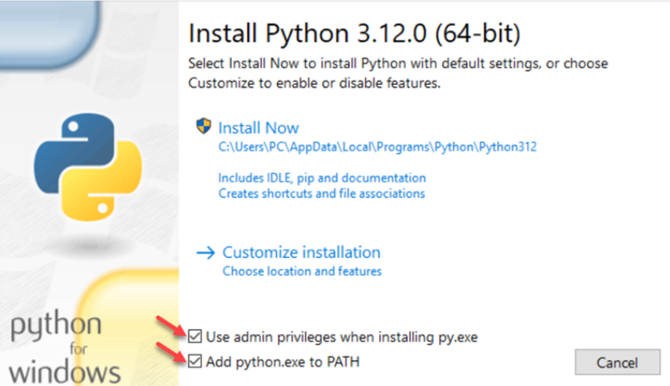

:::info[Py on NT]

The installation requires downloading the official Python .exe installer and running it on your system. The sections below will explain several options and details during the installation process.

:::

### Step 1: Select Python Version
Deciding on a version depends on what you want to do in Python. The two major versions are Python 2 and Python 3. Choosing one over the other might be better depending on your project details. If there are no constraints, choose whichever one you prefer.

**We recommend Python 3**, as Python 2 reached its end of life in 2020. Download Python 2 only if you work with legacy scripts and older projects. Also, choose a stable release over the newest since the newest release may have bugs and issues.

### Step 2: Download Python
Start by downloading the Python executable installer for Windows:

1. Open a web browser and navigate to the [Downloads for Windows section](https://www.python.org/downloads/windows/) of the official Python website.

2. Locate the desired Python version.

3. Click the link to download the file. Choose either the Windows 32-bit or 64-bit installer.

### Step 3: Run Executable Installer
The steps below guide you through the installation process:

1. Run the downloaded Python Installer.

2. The installation window shows two checkboxes:

Admin privileges. The parameter controls whether to install Python for the current or all system users. This option allows you to change the installation folder for Python.
Add Python to PATH. The second option places the executable in the PATH variable after installation. You can also add Python to the PATH environment variable manually later.

For the most straightforward installation, we recommend ticking both checkboxes.

3. Select the Install Now option for the recommended installation (in that case, skip the next two steps).

To adjust the default installation options, choose Customize installation instead and proceed to the following step:

The default installation installs Python to ``C:\Users\[user]\AppData\Local\Programs\Python\Python[version]`` for the current user. It includes IDLE (the default Python editor), the PIP package manager, and additional documentation. The installer also creates necessary shortcuts and file associations.

Customizing the installation allows changing these installation options and parameters.

4. Choose the optional installation features. Python works without these features, but adding them improves the program's usability.

Click **Next** to proceed to the Advanced Options screen.

5. The second part of customizing the installation includes advanced options.

Choose whether to install Python for all users. The option changes the install location to ``C:\Program Files\Python[version]``. If selecting the location manually, a common choice is C:\Python[version] because it avoids spaces in the path, and all users can access it. Due to administrative rights, both paths may cause issues during package installation.

Other advanced options include creating shortcuts, file associations, and adding Python to PATH.

After picking the appropriate options, click Install to start the installation.

6. Select whether to disable the path length limit. Choosing this option will allow Python to bypass the 260-character MAX_PATH limit.

The option will not affect any other system settings, and disabling it resolves potential name-length issues. We recommend selecting the option and closing the setup.

