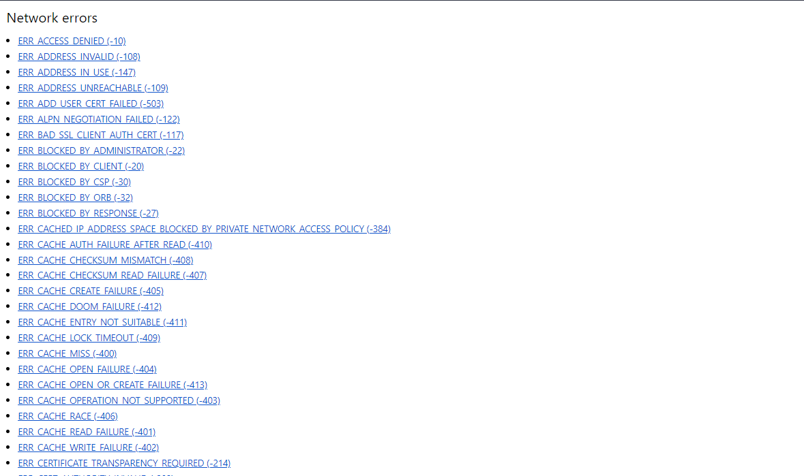
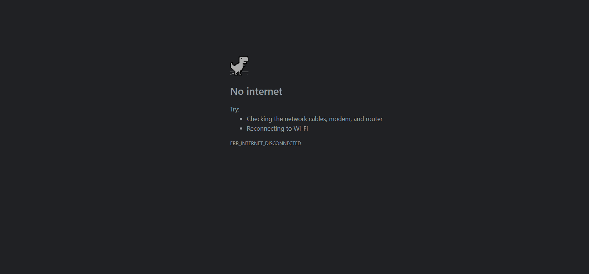
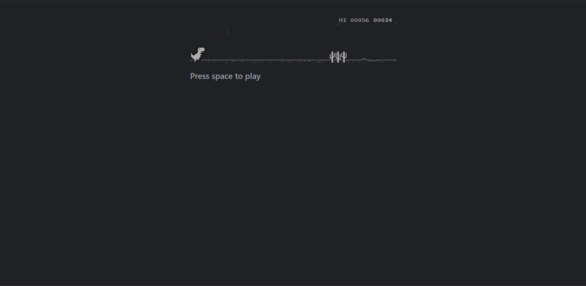

import Tabs from "@theme/Tabs";
import TabItem from "@theme/TabItem";
import BrowserWindow from '@site/src/components/BrowserWindow';
import Admonition from '@theme/Admonition';
import IframeWindow from '@site/src/components/BrowserWindow/IframeWindow';

<!-- Prettier doesn't change this -->

:::info[Easter eggs]
Here are some examples we can utilized in the web browser to **present network error messages**, **experimental features**, and some **dino stuff**.
:::
<!-- Prettier doesn't change this -->

### Network errors
The following are useful in resolving network connection problems.

<Tabs groupId="web-browsers">
  <TabItem value="brave" label="Brave">
    ```md
    brave://network-errors
    ```
  </TabItem>
  <TabItem value="edge" label="Edge">
    ```md
    edge://network-errors
    ```
  </TabItem>
  <TabItem value="chrome" label="Chrome">
    ```md
    chrome://network-errors
    ```
  </TabItem>
</Tabs>

<BrowserWindow>

</BrowserWindow>

<!-- Prettier doesn't change this -->
:::tip[**Let's try**]


```md
brave://network-error/-106
``` 
:::

<BrowserWindow>

</BrowserWindow>


<!-- Prettier doesn't change this -->

### Flags
This URL provides access to an advanced settings page where users can enable or disable experimental features and customize various aspects of the browser's functionality.

<Tabs groupId="web-browsers">
  <TabItem value="brave" label="Brave">
    ```md
    brave://flags
    ```
  </TabItem>
  <TabItem value="edge" label="Edge">
    ```md
    edge://flags
    ```
  </TabItem>
  <TabItem value="chrome" label="Chrome">
    ```md
    chrome://flags
    ```
  </TabItem>
</Tabs>
<!-- Prettier doesn't change this -->
:::danger[Keep in mind]
By enabling these features, you could lose browser data or compromise your security or privacy. **Use at your own risk.**
:::

### Dino
The classic 'No-internet-no-problem'.

<Tabs groupId="web-browsers">
  <TabItem value="brave" label="Brave">
    ```md
    brave://dino
    ```
  </TabItem>
  <TabItem value="edge" label="Edge">
    ```md
    edge://dino
    ```
  </TabItem>
  <TabItem value="chrome" label="Chrome">
    ```md
    chrome://dino
    ```
  </TabItem>
</Tabs>

<BrowserWindow>

</BrowserWindow>


