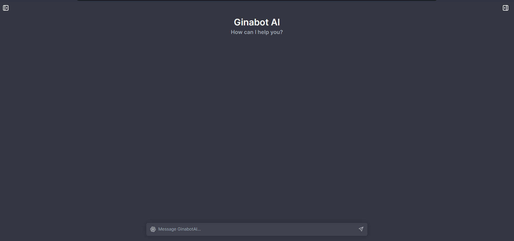
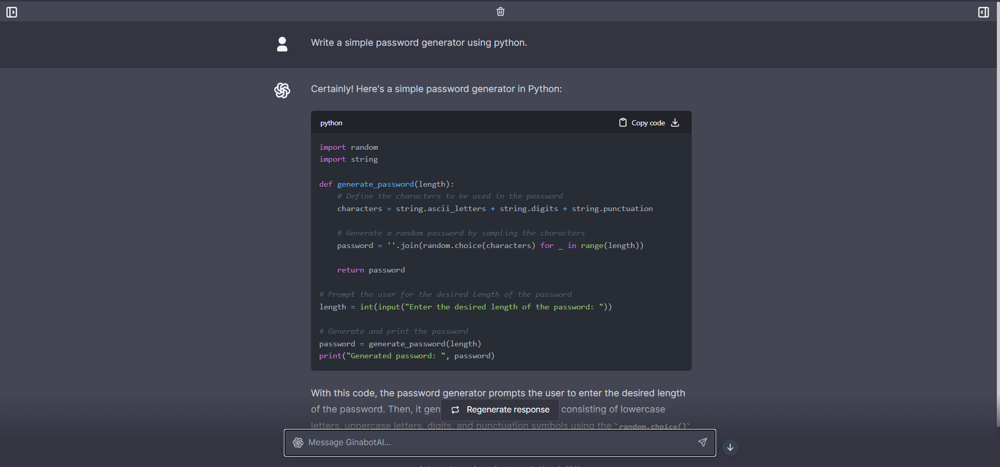

:::info[About]

A demo chat assist project extended by mkeithX.

Check out **[Live Demo](https://ginabot-ai.vercel.app)**.


:::

1. Clone repo

```
git clone https://github.com/mkeithx/ginabot-ai.git
```

2. Install Dependencies

```
npm i
```
3. Create a .env.local file in the root of the repo with your OpenAI API Key:

```
OPENAI_API_KEY=YOUR_KEY
```

:::tip
You can set `OPENAI_API_HOST` where access to the official OpenAI host is restricted or unavailable, allowing users to configure an alternative host for their specific needs.

Additionally, if you have multiple OpenAI Organizations, you can set `OPENAI_ORGANIZATION` to specify one.
:::

4. Run locally.

```
npm run dev
```

:::info[Configuration]
When deploying the application, the following environment variables can be set:
:::

| Environment Variable              | Default value                  | Description                                                                                                                               |
| --------------------------------- | ------------------------------ | ----------------------------------------------------------------------------------------------------------------------------------------- |
| OPENAI_API_KEY                    |                                | The default API key used for authentication with OpenAI                                                                                   |
| OPENAI_API_HOST                   | `https://api.openai.com`       | The base url, for Azure use `https://<endpoint>.openai.azure.com`                                                                         |
| OPENAI_API_TYPE                   | `openai`                       | The API type, options are `openai` or `azure`                                                                                             |
| OPENAI_API_VERSION                | `2023-03-15-preview`           | Only applicable for Azure OpenAI                                                                                                          |
| AZURE_DEPLOYMENT_ID               |                                | Needed when Azure OpenAI, Ref [Azure OpenAI API](https://learn.microsoft.com/zh-cn/azure/cognitive-services/openai/reference#completions) |
| OPENAI_ORGANIZATION               |                                | Your OpenAI organization ID                                                                                                               |
| DEFAULT_MODEL                     | `gpt-3.5-turbo`                | The default model to use on new conversations, for Azure use `gpt-35-turbo`                                                               |
| NEXT_PUBLIC_DEFAULT_SYSTEM_PROMPT |                              | The default system prompt to use on new conversations                                                                                     |
| NEXT_PUBLIC_DEFAULT_TEMPERATURE   | 1                              | The default temperature to use on new conversations                                                                                       |
| GOOGLE_API_KEY                    |                                | See [Custom Search JSON API documentation][GCSE]                                                                                          |
| GOOGLE_CSE_ID                     |                                | See [Custom Search JSON API documentation][GCSE]                                                                                          |

If you do not provide an OpenAI API key with `OPENAI_API_KEY`, users will have to provide their own key.

If you don't have an OpenAI API key, you can get one [here](https://platform.openai.com/account/api-keys).

Screenshots


